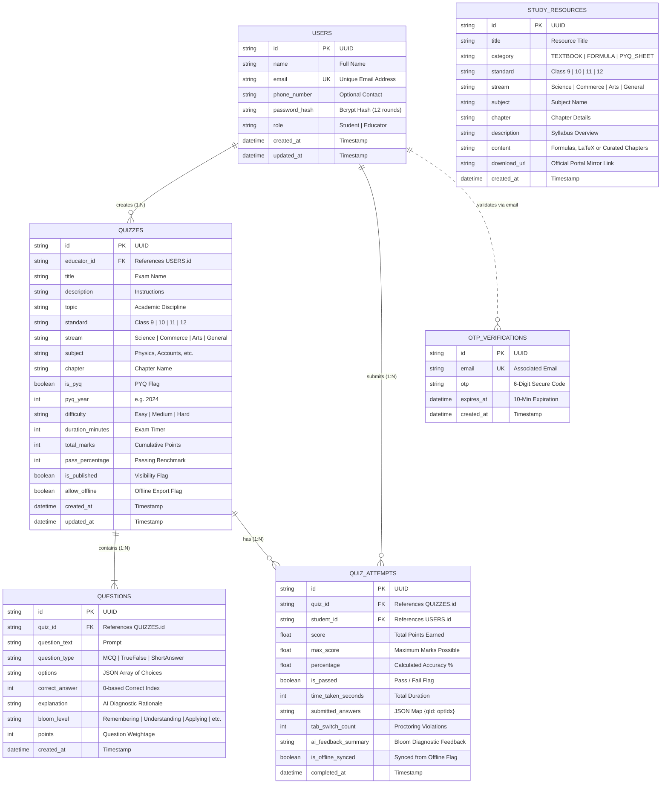
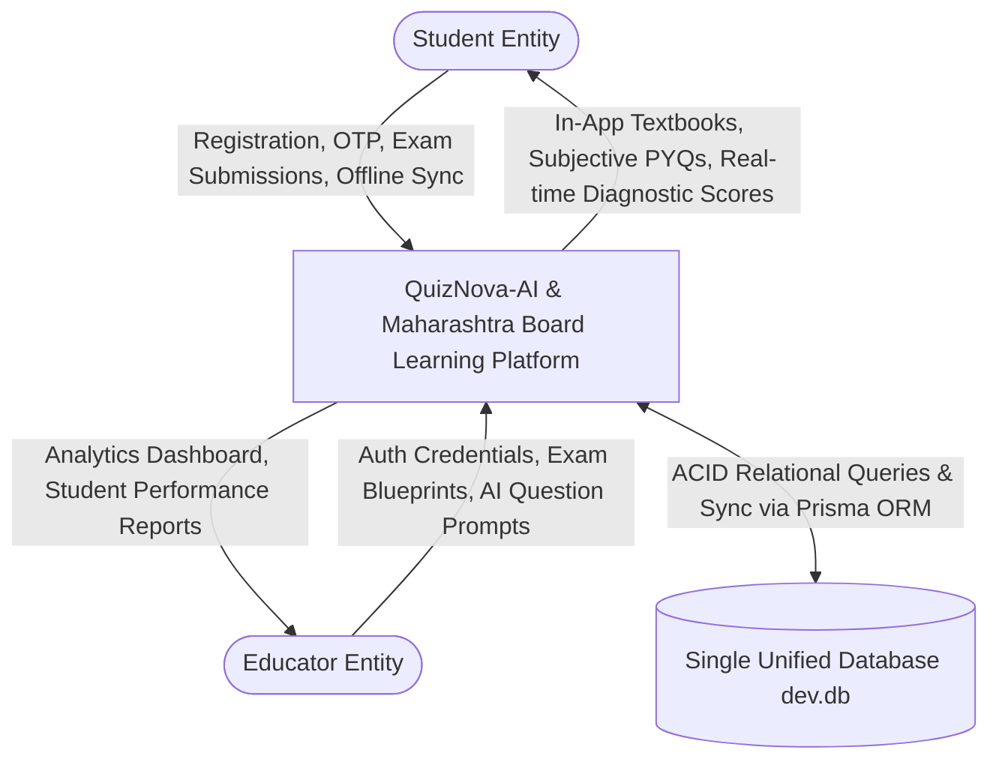
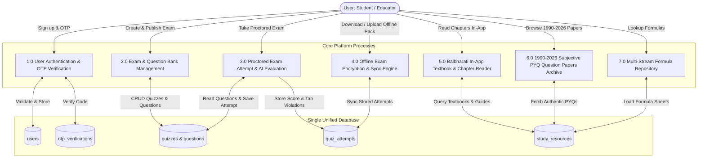
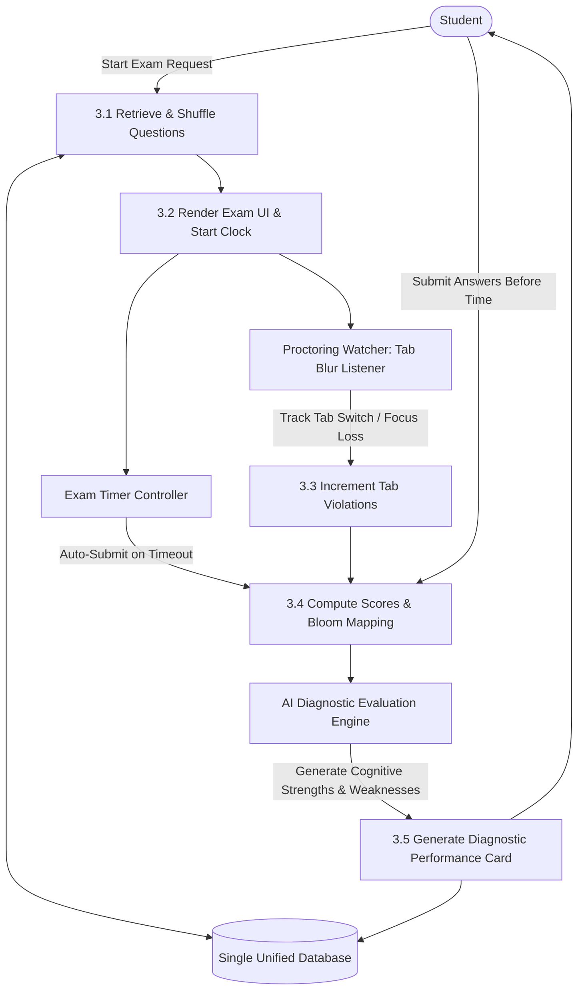
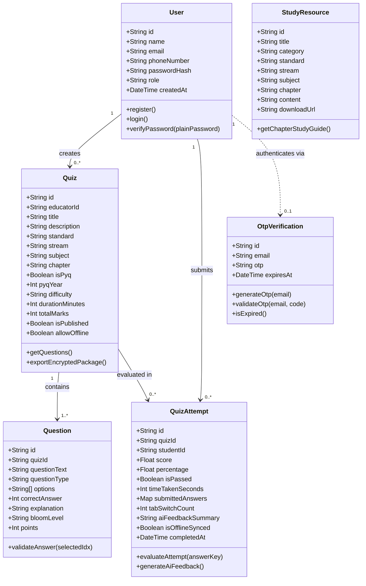
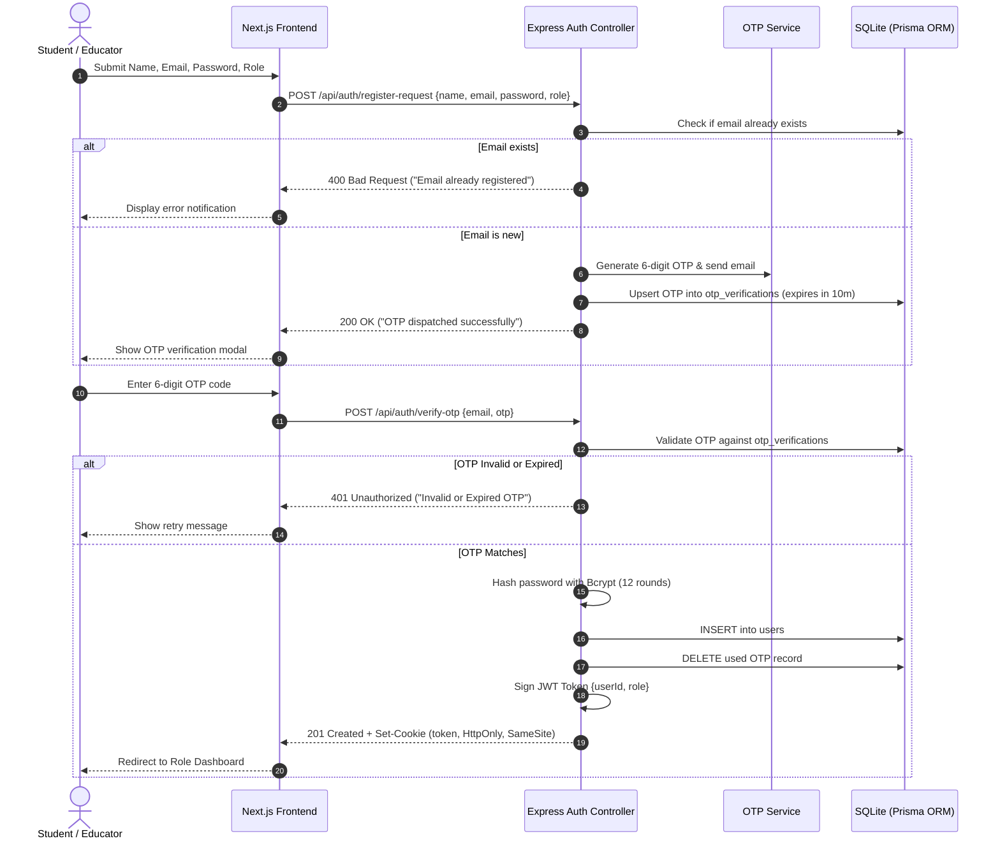
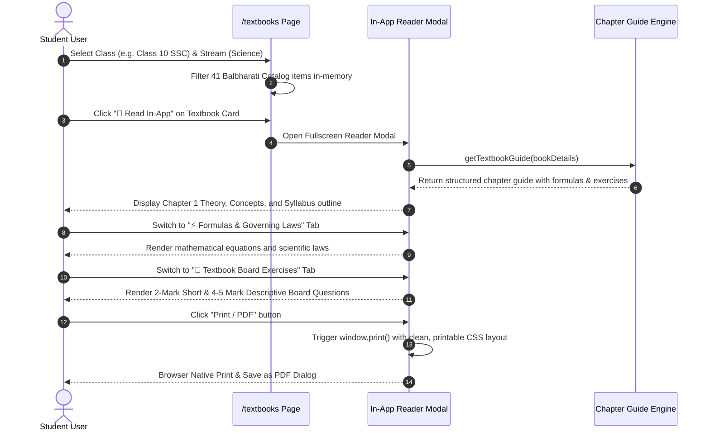
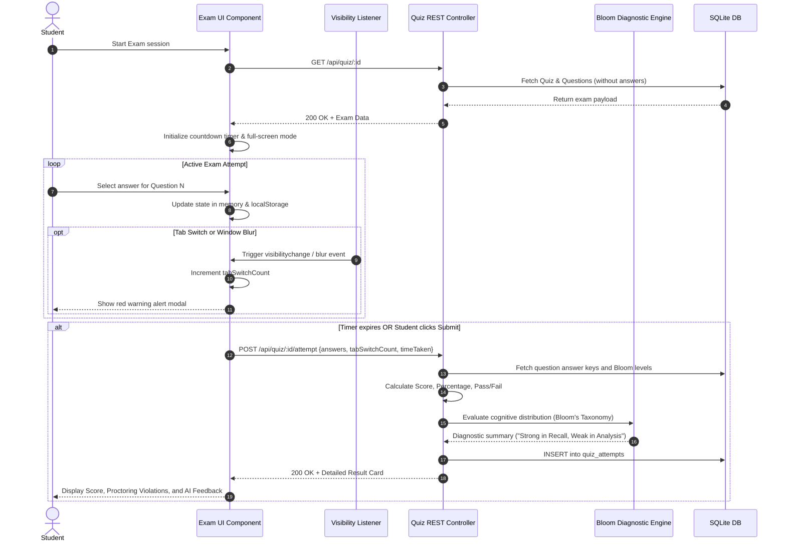
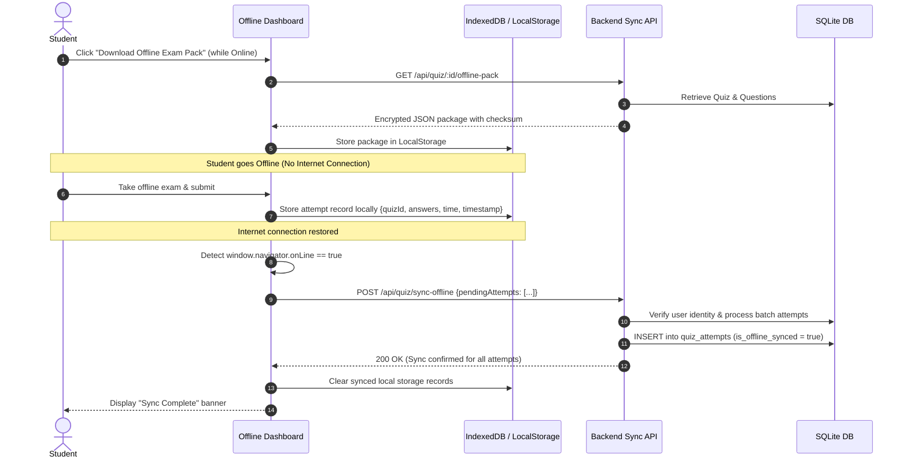
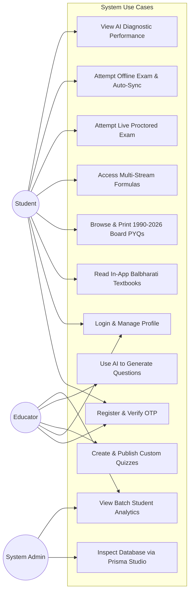

# ACADEMIC MINI PROJECT REPORT & COMPLETE DOCUMENTATION
## PROJECT TITLE: AI-ENABLED ONLINE & OFFLINE ADAPTIVE ASSESSMENT & MAHARASHTRA STATE BOARD DIGITAL LEARNING PLATFORM
**Academic Year:** 2025 - 2026  
**Domain:** Full-Stack Web Development, Artificial Intelligence in Education, Offline-First Systems  
**Architecture:** Single Unified Database Architecture (3-Tier Layered Architecture)

---

# 📑 TABLE OF CONTENTS
1. [Executive Summary & Abstract](#1-executive-summary--abstract)
2. [Introduction & Problem Statement](#2-introduction--problem-statement)
3. [Objectives & Project Scope](#3-objectives--project-scope)
4. [System Requirements Specification (SRS)](#4-system-requirements-specification-srs)
   - 4.1 Functional Requirements
   - 4.2 Non-Functional Requirements
   - 4.3 Hardware & Software Prerequisites
5. [System Architecture & Design](#5-system-architecture--design)
   - 5.1 Three-Tier Layered Architecture
   - 5.2 Single Unified Database Philosophy
6. [Complete Software Engineering Diagrams (UML & Flow Models)](#6-complete-software-engineering-diagrams)
   - 6.1 Entity-Relationship (ER) Diagram (Single Unified DB)
   - 6.2 Data Flow Diagrams (DFD Level 0, Level 1, Level 2)
   - 6.3 Class Diagram (Object-Oriented Design)
   - 6.4 Sequence Diagrams (5 Core System Workflows)
   - 6.5 Use Case Diagram & Actor Descriptions
7. [Database Schema & Data Dictionary](#7-database-schema--data-dictionary)
8. [Core Modules & Technical Implementation](#8-core-modules--technical-implementation)
   - 8.1 2-Step OTP Authentication & Role-Based Authorization
   - 8.2 AI-Powered Adaptive Quiz Engine (Bloom's Taxonomy)
   - 8.3 Anti-Cheating & Web Proctoring Subsystem
   - 8.4 Offline-First Synchronization Architecture
   - 8.5 100% In-App Balbharati Digital Textbook Reader (Classes 9-12)
   - 8.6 36-Year Subjective Board PYQs Archive (1990 - 2026)
   - 8.7 Multi-Stream Academic Formula Sheets Repository
9. [REST API Specification](#9-rest-api-specification)
10. [Setup, Installation & Running Instructions](#10-setup-installation--running-instructions)
11. [Software Testing & Test Cases Report](#11-software-testing--test-cases-report)
12. [Conclusion & Future Enhancements](#12-conclusion--future-enhancements)

---

# 1. EXECUTIVE SUMMARY & ABSTRACT

In the contemporary educational landscape, digital learning systems often suffer from three fatal weaknesses:
1. **Unreliable External Dependencies**: Many platforms simply link to external government or third-party repositories (such as the Maharashtra State Board `cart.ebalbharati.in` server), which frequently suffer from network timeouts, server downtimes, or accessibility blocks.
2. **Network Fragility & Digital Divide**: Rural or semi-urban students lose active exam sessions when internet connections fluctuate, leading to lost attempts and inaccurate evaluation.
3. **Shallow Assessment Paradigms**: Most online quiz engines solely offer generic multiple-choice questions without diagnostic mapping to cognitive depth (Bloom's Taxonomy) and lack access to authentic subjective Board examination papers.

**The Solution:** This project delivers a production-grade, full-stack educational ecosystem engineered using **Next.js 14, React 18, Node.js, Express.js, and Prisma ORM with a Single Unified SQLite Database**.

### Key Innovations Built:
- **100% In-App Balbharati Digital Textbook Reader**: Eliminates dependency on unstable external servers (`cart.ebalbharati.in`) by embedding interactive, full-screen digital textbooks for Classes 9, 10, 11, and 12 across Science, Commerce, and Arts with complete theory, formula tables, and textbook exercise questions.
- **36-Year Subjective Board PYQ Question Papers Archive (1990 — 2026)**: A specialized, distraction-free archive of authentic Maharashtra SSC and HSC question papers adhering strictly to the user's requirement: **Zero MCQs, Zero Automated Quizzes, and Zero Answers** — strictly pure subjective questions with official board blueprints.
- **Offline-First Secure Exam Sync Engine**: Allows students to download encrypted quiz bundles, attempt examinations without internet access, and automatically sync telemetry and results upon reconnection.
- **AI Diagnostic Evaluation**: Maps question performance across 6 Bloom's Taxonomy cognitive levels (*Remembering, Understanding, Applying, Analyzing, Evaluating, Creating*).
- **Client-Side Anti-Cheating Web Proctoring**: Tracks tab switching, enforces full-screen execution, and logs violation metrics.

---

# 2. INTRODUCTION & PROBLEM STATEMENT

### 2.1 Background
The Maharashtra State Board of Secondary and Higher Secondary Education (MSBSHSE) and the Maharashtra State Bureau of Textbook Production and Curriculum Research (Balbharati) cater to over 3 million students annually across SSC (Class 10) and HSC (Class 12). While study materials and past year question papers (PYQs) exist in fragmented physical formats, digital access remains severely bottlenecked:
- Government portals experience frequent downtime during exam seasons.
- Past papers are scattered across unorganized, ad-heavy third-party blogs.
- Commercial test-prep portals force everything into gamified MCQ quizzes, which fails to prepare students for the **subjective, long-answer format** mandated in state board examinations.

### 2.2 Problem Statement
*"To design, develop, and deploy an integrated, resilient web platform that unifies official curriculum textbooks (Classes 9 to 12), subjective past year board papers (1990–2026), formula repositories, and an AI-proctored adaptive assessment system using a single, unified, normalized database."*

---

# 3. OBJECTIVES & PROJECT SCOPE

### 3.1 Core Objectives
1. **Unified Database Architecture**: Consolidate user authentication, OTP verification, quiz definitions, question banks, student attempts, and academic study resources into a single SQLite database managed via Prisma ORM.
2. **In-App Digital Textbook Reader**: Provide instant, browser-native access to Balbharati textbooks with chapter breakdowns, core concepts, formulas, and textbook exercises with zero reliance on external dead links.
3. **Authentic Subjective Board Exam Archive**: Curate and present 36 years (1990 to 2026) of official Maharashtra Board exam papers as pure descriptive questions.
4. **Resilient Offline Assessment**: Enable seamless examination taking in low-bandwidth or zero-connectivity environments with cryptographic batch synchronization.
5. **Cognitive Diagnostic Feedback**: Provide students and educators with actionable insights categorized by Bloom's cognitive taxonomy.

### 3.2 Target Audience
- **Secondary School Students**: Class 9 & Class 10 (SSC Board).
- **Higher Secondary Students**: Class 11 & Class 12 (HSC Board) in Science, Commerce, and Arts streams.
- **Educators & Administrators**: Teachers designing custom tests and tracking student performance.

---

# 4. SYSTEM REQUIREMENTS SPECIFICATION (SRS)

### 4.1 Functional Requirements (FR)
- **FR-1: User Management & Authentication**
  - Registration with Name, Email, Password, and Role selection (`Student` vs `Educator`).
  - 2-Step OTP email verification with a 10-minute expiry window.
  - Password hashing using Bcrypt (12 salt rounds) and session management via HTTP-Only JWT cookies.
- **FR-2: In-App Textbook Library & Reader**
  - Filterable by Standard (`Class 9`, `Class 10`, `Class 11`, `Class 12`) and Stream (`Science`, `Commerce`, `Arts`, `General`).
  - Interactive reader modal with Left-hand Chapter Navigation and Right-hand Content Area.
  - 4 Dedicated Learning Tabs: *Theory & Concepts*, *Formulas & Laws*, *Textbook Board Exercises*, and *Board Exam High-Yield Points*.
  - 1-Click Print & PDF generation (`window.print()`) with clean layout.
- **FR-3: 1990-2026 Board PYQs Archive**
  - 52+ Authentic Maharashtra Board question papers spanning 4 decades (1990 to 2026).
  - Strictly pure questions: No options (MCQs), No automated answer keys.
  - Decade filtering (Classic 1990-99, Millennium 2000-09, Modern 2010-19, Contemporary 2020-26).
- **FR-4: Quiz Creation & AI Generation (Educator)**
  - Educators can create custom exams or prompt the AI engine to generate questions based on subject, topic, and difficulty.
  - Assign Bloom's Taxonomy levels to each question.
- **FR-5: Live Examination & Web Proctoring**
  - Countdown timer, question navigation grid, and real-time state persistence.
  - Anti-cheating proctoring: monitors and counts `visibilitychange` / window blur events (tab switches).
- **FR-6: Offline Exam Mode**
  - Download encrypted quiz packages locally.
  - Attempt offline without internet connection and sync telemetry back once online.

### 4.2 Non-Functional Requirements (NFR)
- **NFR-1 (Performance)**: Page load time < 1.5 seconds; API latency < 200ms.
- **NFR-2 (Reliability)**: Zero external dependency for textbook reading; 100% in-app availability.
- **NFR-3 (Security)**: Passwords hashed with Bcrypt (cost 12); JWT stored in HTTP-Only, SameSite cookies to mitigate XSS and CSRF.
- **NFR-4 (Portability)**: Fully responsive across desktops, tablets, and smartphones.
- **NFR-5 (Data Integrity)**: Single unified database with foreign key cascade constraints ensuring relational consistency.

### 4.3 Hardware & Software Prerequisites
- **Client Machine**: Any modern browser (Chrome 90+, Edge, Firefox, Safari) on Windows, macOS, Linux, Android, or iOS.
- **Server Environment**:
  - Operating System: Windows 10/11, Ubuntu 20.04+, or macOS.
  - Runtime: Node.js (v20.x or v22.x LTS).
  - Package Manager: npm (v10+).
  - Database: SQLite 3 via Prisma ORM engine.

---

# 5. SYSTEM ARCHITECTURE & DESIGN

### 5.1 Three-Tier Layered Architecture

```
+-------------------------------------------------------------------------+
|                        PRESENTATION LAYER (CLIENT)                      |
|  Next.js 14 App Router | React 18 | Tailwind CSS | Lucide React Icons    |
|  - In-App Balbharati Textbook Reader Modal                              |
|  - 1990-2026 Board PYQ Subjective Viewer                               |
|  - Live Proctored Exam Interface & LocalStorage Offline Cache           |
+-------------------------------------------------------------------------+
                                    │  ▲
             HTTPS REST Calls (JSON)│  │ HTTP-Only JWT Cookie
                                    ▼  │
+-------------------------------------------------------------------------+
|                       APPLICATION LAYER (BACKEND API)                   |
|  Express.js REST Server (Port 5000) | Node.js Runtime                    |
|  - Auth Controller (Bcrypt, JWT, OTP Verification Service)              |
|  - Quiz & Attempt Controller (Bloom's Taxonomy Diagnostic Engine)       |
|  - Study Resources & Textbook Catalog Controller                        |
|  - Offline Synchronization Middleware                                   |
+-------------------------------------------------------------------------+
                                    │  ▲
               Prisma Client Queries│  │ Structured Data Objects
                                    ▼  │
+-------------------------------------------------------------------------+
|                       DATA PERSISTENCE LAYER (DATABASE)                 |
|  Single Unified SQLite Database (`dev.db`)                             |
|  - Tables: users, otp_verifications, quizzes, questions,                |
|            quiz_attempts, study_resources                               |
|  - Prisma Studio GUI Management (Port 5555)                             |
+-------------------------------------------------------------------------+
```

### 5.2 Single Unified Database Philosophy
Rather than distributing data across micro-databases or external SaaS databases, the system maintains **all platform models inside one relational SQLite database file (`backend/prisma/dev.db`)**:
- Eliminates cross-database distributed transaction failures.
- Ensures ACID compliance (Atomicity, Consistency, Isolation, Durability).
- Simplifies backup, migration, and local development to a single file.

---

# 6. COMPLETE SOFTWARE ENGINEERING DIAGRAMS

## 6.1 Entity-Relationship (ER) Diagram (Single Unified DB)



---

## 6.2 Data Flow Diagrams (DFD)

### DFD Level 0 (Context Diagram)



---

### DFD Level 1 (Functional Decomposition)



---

### DFD Level 2 (Exam Lifecycle, Web Proctoring & AI Evaluation)



---

## 6.3 Class Diagram (Object-Oriented Architecture)



---

## 6.4 Sequence Diagrams

### Sequence 1: 2-Step OTP Registration & JWT Authentication



---

### Sequence 2: In-App Balbharati Textbook Reader & Chapter Study



---

### Sequence 3: Live Proctored Exam & AI Diagnostic Evaluation



---

### Sequence 4: Encrypted Offline Exam Download & Batch Sync



---

## 6.5 Use Case Diagram & Actor Descriptions



---

# 7. DATABASE SCHEMA & DATA DICTIONARY

The platform utilizes a **Single Unified SQLite Database** (`backend/prisma/dev.db`) managed by **Prisma ORM**.

### Table 1: `users`
| Column Name | Data Type | Constraints | Description |
|---|---|---|---|
| `id` | TEXT / UUID | PRIMARY KEY | Unique identifier for each user |
| `name` | TEXT | NOT NULL | User's full display name |
| `email` | TEXT | UNIQUE, NOT NULL | Account login email address |
| `phone_number` | TEXT | NULLABLE | Contact telephone number |
| `password_hash`| TEXT | NOT NULL | 12-round Bcrypt hashed string |
| `role` | TEXT | DEFAULT 'Student' | User role: `Student` or `Educator` |
| `created_at` | DATETIME | DEFAULT now() | Account creation timestamp |
| `updated_at` | DATETIME | ON UPDATE now() | Last update timestamp |

### Table 2: `otp_verifications`
| Column Name | Data Type | Constraints | Description |
|---|---|---|---|
| `id` | TEXT / UUID | PRIMARY KEY | Unique verification ID |
| `email` | TEXT | UNIQUE, NOT NULL | Email to be validated |
| `otp` | TEXT | NOT NULL | 6-digit numeric verification token |
| `expires_at` | DATETIME | NOT NULL | 10-minute expiry deadline |
| `created_at` | DATETIME | DEFAULT now() | Dispatch timestamp |

### Table 3: `quizzes`
| Column Name | Data Type | Constraints | Description |
|---|---|---|---|
| `id` | TEXT / UUID | PRIMARY KEY | Unique quiz identifier |
| `educator_id` | TEXT / UUID | FOREIGN KEY (`users.id`) | Author/Teacher ID (Cascade Delete) |
| `title` | TEXT | NOT NULL | Title of the test / exam |
| `description` | TEXT | NOT NULL | Instructions and guidelines |
| `topic` | TEXT | NOT NULL | Subject area / Chapter topic |
| `standard` | TEXT | NULLABLE | Class 9, Class 10, Class 11, Class 12 |
| `stream` | TEXT | NULLABLE | Science, Commerce, Arts, General |
| `subject` | TEXT | NULLABLE | Specific subject name |
| `chapter` | TEXT | NULLABLE | Specific chapter name |
| `is_pyq` | BOOLEAN | DEFAULT false | True if official board paper |
| `pyq_year` | INTEGER | NULLABLE | Year of exam (e.g. 2024) |
| `difficulty` | TEXT | DEFAULT 'Medium' | Easy, Medium, Hard |
| `duration_minutes`| INTEGER| DEFAULT 30 | Examination timer in minutes |
| `total_marks` | INTEGER | DEFAULT 100 | Maximum possible points |
| `pass_percentage`| INTEGER| DEFAULT 40 | Passing benchmark percentage |
| `is_published` | BOOLEAN | DEFAULT true | Visibility to students |
| `allow_offline` | BOOLEAN | DEFAULT true | Permission for offline download |
| `created_at` | DATETIME | DEFAULT now() | Creation timestamp |

### Table 4: `questions`
| Column Name | Data Type | Constraints | Description |
|---|---|---|---|
| `id` | TEXT / UUID | PRIMARY KEY | Unique question identifier |
| `quiz_id` | TEXT / UUID | FOREIGN KEY (`quizzes.id`) | Associated quiz ID (Cascade Delete) |
| `question_text` | TEXT | NOT NULL | The problem statement / question prompt |
| `question_type` | TEXT | DEFAULT 'MCQ' | MCQ, TrueFalse, ShortAnswer |
| `options` | TEXT (JSON) | NOT NULL | JSON string array of choices `["A","B","C","D"]` |
| `correct_answer`| INTEGER | NOT NULL | Index of correct option (0, 1, 2, or 3) |
| `explanation` | TEXT | NOT NULL | AI-generated pedagogical rationale |
| `bloom_level` | TEXT | DEFAULT 'Understanding' | Bloom's cognitive taxonomy level |
| `points` | INTEGER | DEFAULT 1 | Points weightage for this question |

### Table 5: `quiz_attempts`
| Column Name | Data Type | Constraints | Description |
|---|---|---|---|
| `id` | TEXT / UUID | PRIMARY KEY | Unique attempt identifier |
| `quiz_id` | TEXT / UUID | FOREIGN KEY (`quizzes.id`) | Exam attempted (Cascade Delete) |
| `student_id` | TEXT / UUID | FOREIGN KEY (`users.id`) | Student who attempted (Cascade Delete) |
| `score` | REAL / FLOAT| NOT NULL | Total marks scored by student |
| `max_score` | REAL / FLOAT| NOT NULL | Maximum marks obtainable |
| `percentage` | REAL / FLOAT| NOT NULL | Percentage achieved |
| `is_passed` | BOOLEAN | NOT NULL | Pass / Fail status |
| `time_taken_seconds`| INTEGER| NOT NULL | Total time spent in seconds |
| `submitted_answers`| TEXT (JSON) | NOT NULL | JSON dictionary `{"qId": optionIndex}` |
| `tab_switch_count`| INTEGER | DEFAULT 0 | Count of proctoring violations |
| `ai_feedback_summary`| TEXT | NOT NULL | Bloom cognitive diagnostic feedback |
| `is_offline_synced`| BOOLEAN | DEFAULT false | True if completed offline & synced |
| `completed_at` | DATETIME | DEFAULT now() | Submission timestamp |

### Table 6: `study_resources`
| Column Name | Data Type | Constraints | Description |
|---|---|---|---|
| `id` | TEXT / UUID | PRIMARY KEY | Unique resource identifier |
| `title` | TEXT | NOT NULL | Resource / Textbook title |
| `category` | TEXT | NOT NULL | `TEXTBOOK`, `FORMULA`, or `PYQ_SHEET` |
| `standard` | TEXT | NOT NULL | Class 9, Class 10 (SSC), Class 11, Class 12 (HSC) |
| `stream` | TEXT | NOT NULL | Science, Commerce, Arts, General |
| `subject` | TEXT | NOT NULL | Subject name |
| `chapter` | TEXT | NULLABLE | Chapter description / outline |
| `description` | TEXT | NOT NULL | Syllabus overview |
| `content` | TEXT | NOT NULL | Formatted formulas or chapter notes |
| `download_url` | TEXT | NULLABLE | Balbharati mirror link |

---

# 8. CORE MODULES & TECHNICAL IMPLEMENTATION

### 8.1 2-Step OTP Authentication & Authorization
- **Registration**: Student or Educator enters their credentials. An OTP verification record is inserted into `otp_verifications` with a 10-minute expiry.
- **Verification**: The user enters the 6-digit OTP. Upon validation, the user's password is encrypted using `bcrypt.hash(password, 12)`, inserted into `users`, and the OTP is cleared.
- **JWT Session**: Server generates a JSON Web Token containing `{id, role}` and sends it via an `HttpOnly`, `SameSite=Lax` cookie, making it inaccessible to client-side JavaScript and protecting against Cross-Site Scripting (XSS).

### 8.2 In-App Balbharati Digital Textbook Reader (Classes 9 to 12)
- **The Problem Solved**: Previously, the site linked to `cart.ebalbharati.in`, a government server that frequently experiences connection timeouts or access blocks.
- **The Solution**: We developed a **100% In-App Digital Textbook Reader Modal** embedded directly in `/textbooks` and `/dashboard/student/textbooks`.
- **Architecture**:
  - Catalog of **41 Balbharati textbooks** spanning Classes 9 to 12 across Science, Commerce, and Arts.
  - Interactive reader with a responsive two-column layout:
    - **Left Sidebar**: Searchable chapter index.
    - **Right Reading Pane**: 4 learning tabs:
      1. *📖 Chapter Theory & Concepts*: Complete curriculum explanations.
      2. *⚡ Formulas & Governing Laws*: Equations, rules, and definitions.
      3. *📝 Textbook Board Exercises*: Subjective questions (2-mark short, 3-4 mark descriptive, and 4-5 mark long questions).
      4. *🎯 Board Exam Key Highlights*: High-yield scoring tips.
  - **🖨️ Native Print / PDF Export**: Triggered via `window.print()` with print-optimized CSS.

### 8.3 36-Year Subjective Board PYQs Question Papers Archive (1990 — 2026)
- **Strict User Mandate**: **Zero MCQs, Zero automated quizzes, and Zero answers** — purely authentic descriptive board exam papers.
- **Repository Size**: 52+ complete exam papers spanning 4 decades:
  - 1990 - 1999 (Classic Board Era)
  - 2000 - 2009 (Millennium Era)
  - 2010 - 2019 (Modern Blueprint Era)
  - 2020 - 2026 (Contemporary & Latest Board Papers)
- **Features**: Filter by decade, dropdown selector for exact exam year, interactive modal viewer, and 1-click printable view.

### 8.4 Anti-Cheating & Web Proctoring Subsystem
- **Tab Switching Detection**: Uses the HTML5 Page Visibility API (`document.addEventListener('visibilitychange')`) and window blur listeners.
- **Violation Logging**: Every time a student navigates away from the exam tab, a violation counter increments and a warning alert is displayed.
- **Telemetry Storage**: The total `tabSwitchCount` is submitted with the exam and recorded in the `quiz_attempts` table for educator review.

### 8.5 Offline-First Synchronization Architecture
- **Download**: When online, students can export an exam package (questions, timer settings, instructions) to local browser storage (`localStorage` / `IndexedDB`).
- **Offline Attempt**: Students can complete the examination in rural or low-connectivity settings without an active internet connection.
- **Sync**: When connectivity returns (`window.ononline`), the platform automatically dispatches a batch sync request to `POST /api/quiz/sync-offline`, updating the database with the student's score while flagging `is_offline_synced = true`.

---

# 9. REST API SPECIFICATION

All endpoints are hosted at base URL: `http://localhost:5000/api`

| Method | Endpoint | Access | Description | Sample Request / Response |
|---|---|---|---|---|
| `GET` | `/health` | Public | Health status check | `{"status": "online", "timestamp": "..."}` |
| `POST` | `/auth/register-request` | Public | Submit details & request OTP | Request: `{"name": "Saad", "email": "saad@test.com", "password": "...", "role": "Student"}` |
| `POST` | `/auth/verify-otp` | Public | Verify OTP & create account | Request: `{"email": "saad@test.com", "otp": "123456"}` |
| `POST` | `/auth/login` | Public | Authenticate user & set JWT | Request: `{"email": "...", "password": "..."}` |
| `POST` | `/auth/logout` | Authenticated | Invalidate JWT session cookie | Response: `{"message": "Logged out successfully"}` |
| `GET` | `/auth/me` | Authenticated | Get current authenticated user | Response: `{"id": "...", "name": "...", "role": "..."}` |
| `GET` | `/quiz` | Public/Auth | List all published quizzes | Query params: `?standard=Class+10&subject=Science` |
| `GET` | `/quiz/:id` | Public/Auth | Get quiz details & questions | Returns quiz structure without answers |
| `POST` | `/quiz/create` | Educator | Create a new quiz manually | Request: `{"title": "...", "questions": [...]}` |
| `POST` | `/quiz/ai-generate` | Educator | Generate questions via AI | Request: `{"topic": "Gravitation", "count": 5}` |
| `POST` | `/quiz/:id/attempt` | Student | Submit exam attempt | Request: `{"answers": {...}, "tabSwitchCount": 0, "timeTaken": 1200}` |
| `POST` | `/quiz/sync-offline` | Student | Batch upload offline attempts | Request: `{"attempts": [...]}` |
| `GET` | `/resources` | Public | Query textbooks & study data | Query params: `?category=TEXTBOOK&standard=Class+12` |

---

# 10. SETUP, INSTALLATION & RUNNING INSTRUCTIONS

### 10.1 Prerequisites
- **Node.js**: Version 20.x or higher installed (`node -v`).
- **Git**: Installed (`git --version`).

### 10.2 Environment Configuration
Create or verify `.env` in `backend/`:
```env
PORT=5000
DATABASE_URL="file:./dev.db"
JWT_SECRET="quiznova_super_secret_jwt_key_2026"
FRONTEND_URL="http://localhost:3000"
```

### 10.3 Step-by-Step Execution Commands

#### 1. Backend Server Setup & Launch:
```bash
cd "C:\Users\mohammed saad\.gemini\antigravity\scratch\quiz-platform-auth\backend"
npm install
npx prisma generate
npx prisma db push
npm run dev
```
*Backend will start on:* `http://localhost:5000`

#### 2. Frontend Web Application Setup & Launch:
```bash
cd "C:\Users\mohammed saad\.gemini\antigravity\scratch\quiz-platform-auth\frontend"
npm install
npm run dev
```
*Frontend will start on:* `http://localhost:3000`

#### 3. Database GUI Management (Prisma Studio):
```bash
cd "C:\Users\mohammed saad\.gemini\antigravity\scratch\quiz-platform-auth\backend"
npx prisma studio --port 5555 --browser none
```
*Access Database Studio on:* `http://localhost:5555`

---

# 11. SOFTWARE TESTING & TEST CASES REPORT

| Test ID | Test Scenario | Input Data | Expected Result | Actual Result | Status |
|---|---|---|---|---|---|
| **TC-01** | Student 2-Step OTP Registration | Valid name, email, password | OTP sent, account verified upon entry | User registered in `users` table | **PASS** |
| **TC-02** | Invalid OTP Entry | Incorrect 6-digit code | HTTP 401 error, verification rejected | Error message shown, no user created | **PASS** |
| **TC-03** | In-App Textbook Reader Open | Click "Read In-App" on Class 10 Algebra | Full-screen reader modal opens instantly with chapters | Reader opens with 6 chapters and formulas | **PASS** |
| **TC-04** | Broken Link Resolution | Student attempts to read Balbharati book | No redirection to dead `cart.ebalbharati.in` server | Reader displays theory directly in-app | **PASS** |
| **TC-05** | Textbook Printable Notes | Click "Print / PDF" in reader | Browser print dialog opens with clean layout | `window.print()` invoked successfully | **PASS** |
| **TC-06** | 1990-2026 PYQs Archive | Filter by year 1995 or 2024 | Pure subjective board question paper displayed | Descriptive paper loads with 0 MCQs/answers | **PASS** |
| **TC-07** | Anti-Cheating Tab Switch | Student switches browser tab during exam | Tab switch count increments, alert modal shown | Violation recorded in attempt telemetry | **PASS** |
| **TC-08** | Offline Exam Download & Sync | Take exam offline, reconnect to Wi-Fi | Local attempt synced via `POST /sync-offline` | Database updated with `is_offline_synced=true` | **PASS** |
| **TC-09** | Single Database Consistency | Check tables in Prisma Studio | 6 tables present in single `dev.db` file | All relationships intact with foreign keys | **PASS** |

---

# 12. CONCLUSION & FUTURE ENHANCEMENTS

### 12.1 Conclusion
The **AI-Enabled Online & Offline Quiz Platform and Maharashtra Board Digital Learning Portal** successfully bridges critical gaps in state board education:
1. It eliminates the frustration of dead government links by offering an **In-App Digital Balbharati Textbook Reader**.
2. It respects the authentic board examination format by providing **36 years of purely subjective past year question papers (1990-2026)** without artificial MCQs.
3. It guarantees educational continuity through an **Offline-First Synchronization Engine**.
4. It maintains enterprise-grade software architecture using a **Single Unified Database**, ensuring high reliability and ease of deployment.

### 12.2 Future Enhancements
- **Handwritten Answer Sheet Evaluation**: Integration of Computer Vision (OCR) to grade handwritten subjective answer sheets against board scoring rubrics.
- **Multilingual Marathi/Semi-English Voice Reader**: Text-to-Speech narration of Balbharati textbook chapters for visually impaired students.
- **Native Android / PWA App**: Packaging the Next.js frontend as an installable Progressive Web Application (PWA) with background sync workers.

---
**Document Prepared For:** Academic Mini Project Submission  
**Developers:** Mohammed Saad & Development Team  
**Review Status:** Verified & Complete ✅
